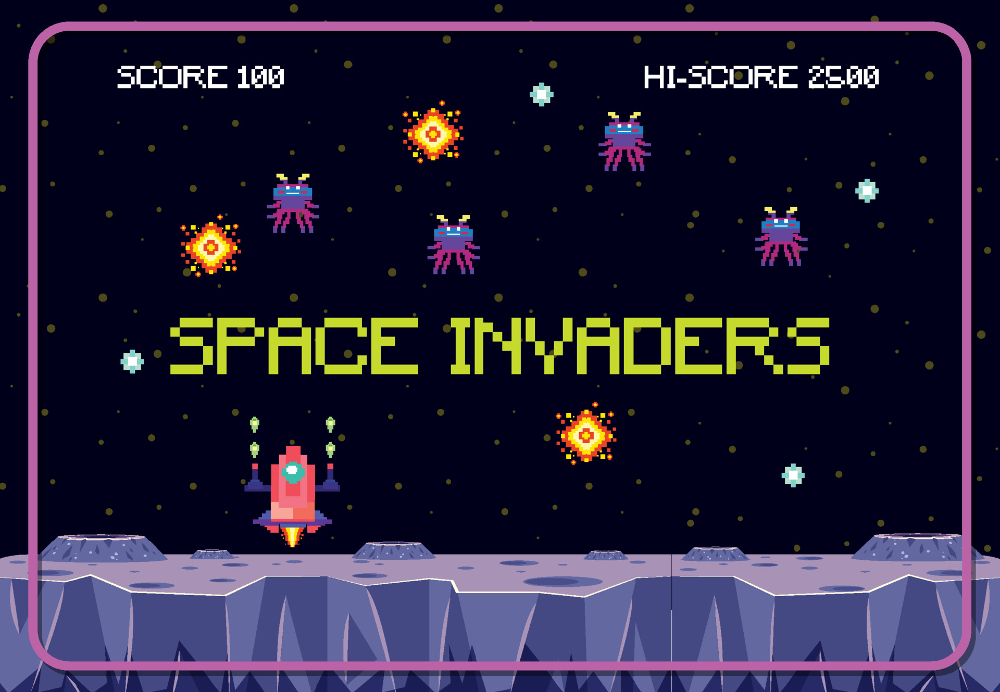

# Projet_jeu
Projet de jeu à des fins de présentation pour Parcoursup

Bonjour et bienvenue dans mon projet.

Ce projet a été réalisé dans le cadre de ma préparation et de ma candidature sur Parcoursup.  
Il a pour objectif de montrer ma motivation à apprendre et à utiliser les outils informatiques, notamment les commandes de base de Git.

À travers ce projet, je m'exerce à :
- créer et gérer un dépôt Git
- utiliser les commandes Git essentielles
- organiser un projet simple en Python
- me familiariser avec les outils utilisés dans le domaine informatique

Ce travail reflète ainsi mon engagement à développer de nouvelles compétences et à progresser de manière autonome.

Origine de l'image :  
<a href="https://www.vecteezy.com/free-vector/space-invaders">Space Invaders Vectors by Vecteezy</a>

# Outils

Projet réalisé avec :
- GIT
- Python
- Tabulate